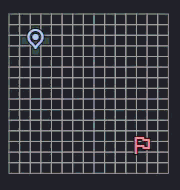
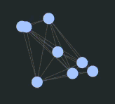

# Intelirota 

Sistema web para análise e otimização do traporte de cargas entre capitais brasileiras, utilizando algortimos de Inteligência Artificial aplicados a grafos.

O projeto modela as capitais do Brasil como vértices de um grafo não direcionado, o qual as conexões representam ligações geográficas entre cidades e os pesos representam distâncias ou custos de deslocamento. A partir dessa modelagem, o sistema calcula rotas demeor custo, gera uma proposta de malha ferroviária mínima e otimiza a seleção de trechos ferroviários considerando demanda e restrições orçamentárias.

## Objetivo

O objetivo principal do Intelirota é auxiliar na análise de cenários logísticos para transporte de cargas entre capitais brasileiras, buscando reduzir custos operacionais por meio de técnicas de busca e otimização.

Entre os  objetivos específicos estão:

- Calcular a rota de menor custo entre duas capitais;
- Gerar uma malha ferroviária conectando todas as captais com menor custo de implantação;
- Otimizar a escolha de trechos ferroviários respeitando limite orçamentário e demanda de transporte;
- Comparar diferentes cenários logísticos, como transporte rodoviário e transporte multimodal;
- Disponibilizar uma interface web para entrada de dados e visualização dos resultados.

## Funcionalidades

- Cálculo da rota de menor custo entre duas capitais usando transporte rodoviário;
- Geração de uma Árvore Geradora Mínima para representar uma malha ferroviária de menor custo;
- Cálculo de rotas otimizadas considerando transporte multimodal;
- Otimização da malha ferroviária com base em demanda e orçamento;
- Exibição do custo total associado às rotas calculadas;
- Interface web para seleção de origem, destino e tipo de análise.

## Modelagem do problema

O problema é representado por um grafo não direcionado:

- **Vértices:** capitais brasileiras;
- **Arestas:** conexões diretas entre capitais com relação geográfica;
- **Pesos:** distâncias entre capitais, utilizadas como base para o cálculo de custos.

Também foi considerada uma exceção específica: Brasília possui conexão direta com Belo Horizonte, além da conexão com Goiânia, conforme definido no enunciado do problema.

## Algoritmos utilizados

### A*


Utilizado para encontrar a rota de menor custo entre duas cidades. O algoritmo considera o custo real já percorrido e uma heurística de estimativa até o destino.

### Kruskal


Utilizado para gerar uma Árvore Geradora Mínima, conectando todas as capitais com o menor custo possível de implantação da malha ferroviária.

### Algoritmo Genético


Utilizado para otimizar a escolha dos trechos ferroviários a serem construídos, considerando:

- Limite de orçamento equivalente a 60% do custo total;
- Demanda de transporte entre cidades;
- Evolução das soluções por seleção, cruzamento e mutação.

## Arquitetura

O sistema segue uma arquitetura cliente-servidor, dividida em backend e frontend.

### Backend

O backend foi desenvolvido em **Java** com **Spring Boot** e é responsável por:

- Processar os dados do grafo;
- Executar os algoritmos de Inteligência Artificial;
- Calcular rotas e custos;
- Disponibilizar endpoints para comunicação com o frontend.

### Frontend

O frontend foi desenvolvido com **React** e **Vite** e é responsável por:

- Permitir a seleção de cidades de origem e destino;
- Permitir a escolha do tipo de análise logística;
- Enviar as solicitações para o backend;
- Exibir os resultados calculados de forma clara para o usuário.

## Tecnologias utilizadas

- Java
- Spring Boot
- React
- Vite
- JavaScript
- Estruturas de dados para grafos
- Arquivos CSV para armazenamento de dados]

# Utilizando o sistema:

Para começar a utilizar o sistema, escolha uma pasta do seu computador onde o projeto será armazenado. Abra o terminal nessa pasta e execute o seguinte comando para clonar o repositório:

```bash
git clone https://github.com/viribeirof/intelirota.git
```

# Rodando o backend

O backend do projeto está localizado na pasta `trabalho-ia-backend`.

## 1. Acessar a pasta do backend:

Estando na raiz do projeto, execute:

```bash
cd trabalho-ia-backend
```

## 2. Instale as dependências:

Para baixar todas as dependências e compilar o projeto, execute:

```bash
mvn clean install
```

Caso queira apenas baixar as dependências, execute:

```bash
mvn dependency:resolve
```

## 3. Executar o backend

Após a instalação, execute:

```bash
mvn spring-boot:run
```

O backend ficará disponível, por padrão, em:
http://localhost:8080


# Rodando o frontend:

O frontend do projeto está localizado na pasta `trabalho-ia-frontend`.

## 1. Acessar a pasta do frontend:

Estando na raiz do projeto, execute:

```bash
cd trabalho-ia-frontend
```

## 2. Instale as dependências:

Após acessar a pasta `trabalho-ia-frontend`, execute o seguinte comando para instalar todas as dependências do projeto:

```bash
npm install
```

## 3. Após a instalação, execute:

```bash
npm run dev
```

O servidor de desenvolvimento ficará disponível em:
http://localhost:5173
